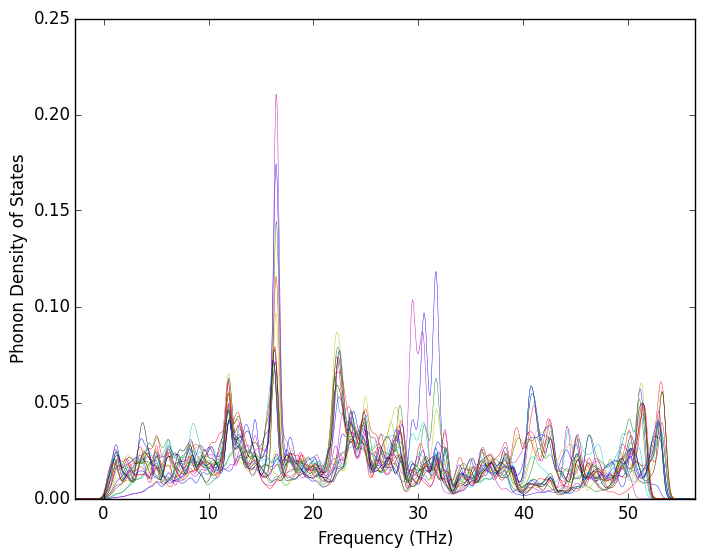
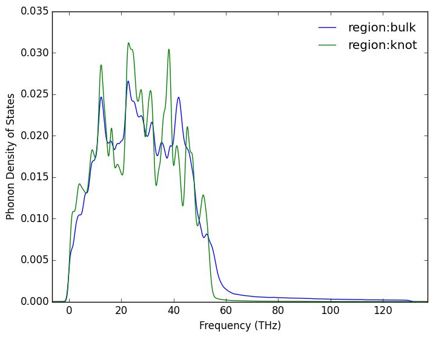
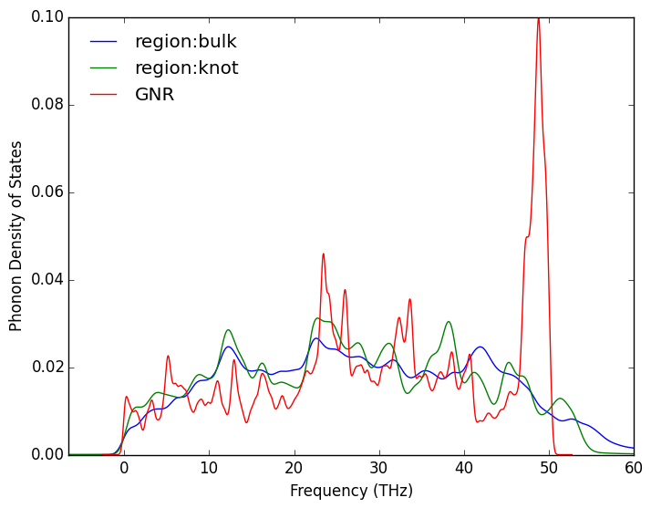

# Density of States 


## graphene
> auto-correlation function with the two ends fixed

``` python
from aces import Aces
class sub(Aces):
	def submit(self):
		opt=dict(
			units="metal",
			species="graphene",
			method="nvt",
			nodes=1,
			procs=12,
			queue="q1.1",
			runTime=500000
			,runner="correlation"
		)
		app=dict(userMini=False,corrNVT=True,timestep=.182e-3,latx=70,laty=2)
		self.commit(opt,app);
if __name__=='__main__':
	sub().run()

```
## knot
> same but with the knot

``` python
from aces import Aces
class sub(Aces):
	def submit(self):
		opt=dict(
			units="metal",
			species="graphene_knot",
			method="nvt",
			nodes=1,
			procs=12,
			queue="q3.4",
			runTime=500000
			,runner="correlation"
		)
		app=dict(corrNVT=True,timestep=.182e-3,latx=70,laty=2)
		self.commit(opt,app);
if __name__=='__main__':
	sub().run()
```
`regiondos.py` calculates the dos of the two regions

``` python
from ase import io
import numpy as np 
atoms=io.read('minimize/POSCAR')
bulk=np.abs(atoms.positions[:,0]-20)<20 
knot=np.abs(atoms.positions[:,0]-70)<20
index=np.arange(len(atoms),dtype='int')-10
def filt(a):
	return a[(a>=0) *(a<520)]
from aces.dos import plot_regiondos
plot_regiondos([(filt(index[bulk]),'bulk'),(filt(index[knot]),'knot')])
```
`muldos.py` draw graphene dos and two region dos of knot

``` python
import pandas as pd
df=pd.read_csv("region_dos.txt",sep=r"[ \t]",engine="python");
npair=len(df.columns)/2
datas=[]
for i in range(npair):
	rname=df.columns[i*2][5:]
	datas.append((df['freq_'+rname],df['dos_'+rname],"region:"+rname))
dc=pd.read_csv("graphenedos.txt",sep=r"[ \t]",engine="python");
datas.append((dc[dc.columns[0]],dc[dc.columns[1]],'GNR'))
from aces.graph import series
series(xlabel='Frequency (THz)',
	ylabel='Phonon Density of States',
	datas=datas
	,linewidth=1
	,filename='camparedos.png',legend=True,xmax=60)
```
### result



<style>img{background:white;width:100%;}</style>

## lc
> method=greekubo so it's periodic along x direction

``` python
from aces import Aces
class sub(Aces):
	def submit(self):
		opt=dict(
			units="metal",
			species="graphene_knot",
			method="greenkubo",
			nodes=1,
			procs=12,
			queue="q1.1",
			runTime=500000
			,runner="correlation"
		)
		app=dict(usephana=False,atomfile='POSCAR',corrNVT=False,timestep=.182e-3,)
		self.commit(opt,app);
if __name__=='__main__':
	sub().run()
```