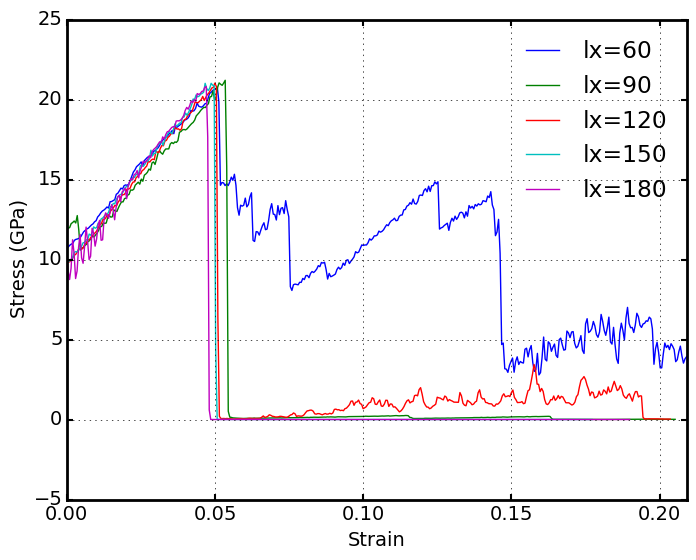

# Make graphene knot with MD

## Original Data

> folders 0,1,2,3,4

the submit method is 
``` python 
opt=dict(
	units="metal",
	species="graphene_knot",
	method="nvt",
	nodes=1,
	procs=4,
	queue="q1.4",
	runTime=10000000
	,runner="strain"
)
for lx in range(60,200,30):
	app=dict(latx=lx,laty=2,maxStrain=.2)
	self.commit(opt,app);
```
There are 5 folders from 0 to 4, representing for different **length** simulation.

Completed calculation will have a file called `cal_stress.txt` and `strain_stress.txt`

## Calculated Data

> folder data , stress_strain.png 

`strain.py` does three things:

- draw stress_strain.png for each of the folders
- draw reduce plot of all the above pngs
- for length in (60,200,30) x strain in int(500000/2000+range(N)/N*2000000.0/4/2000) write POSCAR and png in data folder

> lxs.txt

`getgr.py` is used to search for the length of pure graphene which equals to that of given knot of length [60,90,120,150].

(152.489753098/60) represents for the \\( \unicode{xC5} \\) per  unit lattice .


``` python
from aces.tools import *
from ase import io
for i in [60,90,120,150]:
	atoms=io.read('data/%d_0.0.poscar'%i,format='vasp')
	lx=atoms.positions[:,0].max()-atoms.positions[:,0].min()
	latx=int(lx/(152.489753098/60))
	write("%d\t%d\n"%(i,latx),'lxs.txt','a')
	
```
## Result



<style>[data-origin="images/stress_strain.png"]{background:white;border-radius: 5px;}</style>

