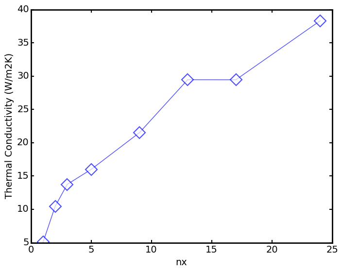

# Stress at different Length

## dT
> calculate TC for different delta T but single POSCAR

``` python 
from aces import Aces
class sub(Aces):
	def submit(self):
		opt=dict(
			units="metal",
			species="graphene_knot",
			method="nvt",
			nodes=1,
			procs=6,
			queue="q1.4",
			runTime=20000000,nvt=True
			,runner="mdTc",atomfile='POSCAR',
			latx=1,useMini=False,timestep=.1e-3,laty=1,latz=1
		)
		for dT in range(0,60,10):
			app=dict(dT=dT)
			self.commit(opt,app);
if __name__=='__main__':
	sub().run()
```

## gk

> Green Kubo calculation of lx=60 but diffent strain using the sample provited in /samples

``` python 
from aces import Aces
class sub(Aces):
	def submit(self):
		opt=dict(
			units="metal",
			species="graphene_knot",
			method="greenkubo",
			nodes=4,
			procs=1,
			queue="q3.4",
			runTime=20000000,nvt=True
			,xp=1,runner="mdTc",latx=1,
			useMini=False,timestep=.1e-3,laty=1,latz=1
		)
		N=8
		for lx,procs,nodes in [(60,6,1)]:
			for j in range(N):
				file='%s_%s.poscar'%(lx,0.05*j/N)
				app=dict(atomfile=file,nodes=nodes,procs=procs)
				self.commit(opt,app);
if __name__=='__main__':
	sub().run()

```

## gr
> NVT calculation of graphene width different Lx,laty=2

``` python 
from aces import Aces
class sub(Aces):
	def submit(self):
		opt=dict(
			units="metal",
			species="graphene",
			method="nvt",
			nodes=1,
			procs=6,
			queue="q1.1",
			runTime=20000000,nvt=True
			,runner="mdTc",dT=20,latx=1,useMini=False,
			timestep=.1e-3,laty=2,latz=1
		)
		N=8
		for lx,procs,nodes in [(60,6,1),(90,6,1),
		(120,12,1),(150,12,1)]:
			app=dict(latx=lx,nodes=nodes,procs=procs)
			self.commit(opt,app);
if __name__=='__main__':
	sub().run()
```
## gr3
> same but laty=3

``` python
from aces import Aces
class sub(Aces):
	def submit(self):
		opt=dict(
			units="metal",
			species="graphene",
			method="nvt",
			nodes=1,
			procs=6,
			queue="q1.1",
			runTime=20000000,nvt=True
			,runner="mdTc",dT=50,latx=1,useMini=False,timestep=.1e-3,laty=3,latz=1
		)
		N=8
		for lx,procs,nodes in [(60,6,1),(90,6,1),(120,12,1),(150,12,1)]:
			app=dict(latx=lx,nodes=nodes,procs=procs)
			self.commit(opt,app);
if __name__=='__main__':
	sub().run()
```
## grshort
> laty=2 but shorter and dT=20

``` python
from aces import Aces
class sub(Aces):
	def submit(self):
		opt=dict(
			units="metal",
			species="graphene",
			method="nvt",
			nodes=1,
			procs=6,
			queue="q1.1",
			runTime=20000000,nvt=True
			,runner="mdTc",dT=20,latx=1,useMini=False,timestep=.1e-3,laty=2,latz=1
		)
		N=8
		for lx,procs,nodes in [(48,6,1),(79,6,1),(110,12,1),(141,12,1)]:
			app=dict(latx=lx,nodes=nodes,procs=procs)
			self.commit(opt,app);
if __name__=='__main__':
	sub().run()
```
## grshort3
> dT=50,laty=3 and the rest is the same with grshort

``` python
from aces import Aces
class sub(Aces):
	def submit(self):
		opt=dict(
			units="metal",
			species="graphene",
			method="nvt",
			nodes=1,
			procs=6,
			queue="q1.1",
			runTime=20000000,nvt=True
			,runner="mdTc",dT=50,latx=1,useMini=False,timestep=.1e-3,laty=3,latz=1
		)
		N=8
		for lx,procs,nodes in [(48,6,1),(79,6,1),(110,12,1),(141,12,1)]:
			app=dict(latx=lx,nodes=nodes,procs=procs)
			self.commit(opt,app);
if __name__=='__main__':
	sub().run()
```
## knotgk
> Green Kubo calculation of laty=1, latx=60 with no strain with 20 seeds.

``` python
from aces import Aces
class sub(Aces):
	def submit(self):
		opt=dict(
			units="metal",
			species="graphene_knot",
			method="greenkubo",
			nodes=1,
			procs=4,
			queue="q1.1",
			runTime=10000000,nvt=True
			,xp=1,runner="mdTc",latx=1,useMini=False,timestep=.1e-3,laty=1,latz=1
		)
		N=8
		for i in range(20):
				file='60_0.0.poscar'
				app=dict(atomfile=file,seed=100+i)
				self.commit(opt,app);
if __name__=='__main__':
	sub().run()
```

## knotgk1
> same with above but reduce corRate=25

``` python
from aces import Aces
class sub(Aces):
	def submit(self):
		opt=dict(
			units="metal",
			species="graphene_knot",
			method="greenkubo",
			nodes=1,
			procs=4,
			queue="q1.1",
			runTime=10000000,nvt=True,corRate=25,
			xp=1,runner="mdTc",latx=1,useMini=False,timestep=.1e-3,laty=1,latz=1
		)
		N=8
		for i in range(20):
				file='60_0.0.poscar'
				app=dict(atomfile=file,seed=100+i)
				self.commit(opt,app);
if __name__=='__main__':
	sub().run()
```
## lx

> narrow knot width different lx and strain

``` python
from aces import Aces
class sub(Aces):
	def submit(self):
		opt=dict(
			units="metal",
			species="graphene_knot",
			method="nvt",
			nodes=1,
			procs=6,
			queue="q1.1",
			runTime=20000000,nvt=True
			,runner="mdTc",dT=50,latx=1,useMini=False,timestep=.1e-3,laty=1,latz=1
		)
		N=8
		for lx,procs,nodes in [(60,6,1),(90,6,1),(120,12,1),(150,12,1)]:
			for j in range(N):
				file='%s_%s.poscar'%(lx,0.05*j/N)
				app=dict(atomfile=file,nodes=nodes,procs=procs)
				self.commit(opt,app);
if __name__=='__main__':
	sub().run()
```
`post.py` aggresive the TC vs. lx @strain and TC vs. strain @lx . lx1 and lx2 is also analyzed here.

``` python
import numpy as np
from aces.tools import *
kappa=[]
i=-1
N=8
for lx,procs,nodes in [(60,6,1),(90,6,1),(120,12,1),(150,12,1)]:
	for j in range(N):
		i+=1
		#if i>19:break
		strain=0.05*j/N
		p=shell_exec('tail -1 %s/result.txt'%i)
		k,=sscanf(p,'kappa_src=%f')
		kappa.append([lx,strain,k])
i=-1
for lx,procs,nodes in [(180,12,1)]:
	for j in range(N):
		continue
		i+=1
		strain=0.05*j/N
		p=shell_exec('tail -1 %s/result.txt'%("../lx2/"+str(i)))
		k,=sscanf(p,'kappa_src=%f')
		kappa.append([lx,strain,k])
kappa=np.array(kappa)
from aces.graph import series,plot,fig,pl
ms=['D','o','x','s','^','p','.','+']
with fig('kappa.png',legend=True):
	strains=np.unique(kappa[:,1])
	i=-1
	for s in strains:
		i+=1
		filter=kappa[:,1]==s

		x=kappa[filter,0]
		y=kappa[filter,2]
		pl.plot(x,y,marker=ms[i],ms=8,mec=None,mfc='w',
		mfcalt="w",mew=1.5,linewidth=1,alpha=.7,label='strain='+str(s))
	pl.xlabel('lx')
	pl.ylabel('Thermal Conductivity (W/m2K)')
	#pl.xlim([0,25])
	pl.xlim([50,160])
	pl.ylim([0,20])
with fig('strain.png',legend=True):
	lxs=np.unique(kappa[:,0])
	i=-1
	for s in lxs:
		i+=1
		filter=kappa[:,0]==s

		x=kappa[filter,1]
		y=kappa[filter,2]
		pl.plot(x,y,marker=ms[i],ms=8,mec=None,mfc='w',
		mfcalt="w",mew=1.5,linewidth=1,alpha=.7,label='lx='+str(s))
	pl.xlabel('strain')
	pl.ylabel('Thermal Conductivity (W/m2K)')
	pl.xlim([-0.002,0.045])
	pl.ylim([0,20])
```

### result


<style>img{background:white;width:100%;}</style>

## lx1
> add point of lx=180

``` python
from aces import Aces
class sub(Aces):
	def submit(self):
		opt=dict(
			units="metal",
			species="graphene_knot",
			method="nvt",
			nodes=1,
			procs=6,
			queue="q1.4",
			runTime=20000000,nvt=True
			,runner="mdTc",dT=50,latx=1,useMini=False,timestep=.1e-3,laty=1,latz=1
		)
		N=8
		for lx,procs,nodes in [(180,12,1)]:
			for j in range(N):
				file='%s_%s.poscar'%(lx,0.05*j/N)
				app=dict(atomfile=file,nodes=nodes,procs=procs)
				self.commit(opt,app);
if __name__=='__main__':
	sub().run()
```
## lx2
> add point of lx=180 with another seed

``` python
from aces import Aces
class sub(Aces):
	def submit(self):
		opt=dict(
			units="metal",
			species="graphene_knot",
			method="nvt",
			nodes=1,
			procs=6,
			queue="q1.4",
			runTime=20000000,nvt=True
			,seed=1058,runner="mdTc",dT=50,latx=1,useMini=False,timestep=.1e-3,laty=1,latz=1
		)
		N=8
		for lx,procs,nodes in [(180,12,1)]:
			for j in range(N):
				file='%s_%s.poscar'%(lx,0.05*j/N)
				app=dict(atomfile=file,nodes=nodes,procs=procs)
				self.commit(opt,app);
if __name__=='__main__':
	sub().run()

```
## mpgr
> Muller Plathe calculation of TC vs. lx of **Graphene**.

``` python
from aces import Aces
class sub(Aces):
	def submit(self):
		opt=dict(
			units="metal",
			species="graphene",
			method="muller",
			nodes=1,
			procs=6,
			queue="q1.1",
			runTime=20000000,nvt=True
			,runner="mdTc",dT=50,latx=1,useMini=False,timestep=.1e-3,laty=2,latz=1
		)
		N=8
		for lx,procs,nodes in [(60,6,1),(90,6,1),(120,12,1),(150,12,1)]:
			app=dict(latx=lx*2,nodes=nodes,procs=procs)
			self.commit(opt,app);
if __name__=='__main__':
	sub().run()

```
## mpknot
> Muller-Plathe calculation of TC. dT=100,laty=1 and use small lx

``` python
from aces import Aces
class sub(Aces):
	def submit(self):
		opt=dict(
			units="metal",
			species="graphene_knot",
			method="muller",
			nodes=1,
			procs=1,
			queue="q1.4",
			runTime=10000000
			,runner="mdTc",dT=100,nvt=True,useMini=False,timestep=.1e-3,laty=1,latz=1
		)
		for lx,procs,nodes in [(2,6,1),(4,6,1)]:
			app=dict(nodes=nodes,procs=procs,atomfile='POSCAR',latx=lx)
			self.commit(opt,app);
if __name__=='__main__':
	sub().run()
```
## nx
> Use the knot as unit , and calculate TC vs. latx

``` python
from aces import Aces
class sub(Aces):
	def submit(self):
		opt=dict(
			units="metal",
			species="graphene_knot",
			method="nvt",
			nodes=1,
			procs=1,
			queue="q1.1",
			runTime=10000000
			,runner="mdTc",dT=100,nvt=True,useMini=False,timestep=.1e-3,laty=1,latz=1
		)
		for lx,procs,nodes in [(1,4,1),(2,4,1),(3,6,1),(5,6,1),(9,12,1),(13,12,3)]:
			app=dict(nodes=nodes,procs=procs,atomfile='POSCAR',latx=lx)
			self.commit(opt,app);
if __name__=='__main__':
	sub().run()
```
`post.py`

result




## nx1
> larger lx

``` python
from aces import Aces
class sub(Aces):
	def submit(self):
		opt=dict(
			units="metal",
			species="graphene_knot",
			method="nvt",
			nodes=1,
			procs=1,
			queue="q1.4",
			runTime=10000000
			,runner="mdTc",dT=100,nvt=True,useMini=False,timestep=.1e-3,laty=1,latz=1
		)
		for lx,procs,nodes in [(17,12,1),(24,12,2),(40,12,3)]:
			app=dict(nodes=nodes,procs=procs,atomfile='POSCAR',latx=lx)
			self.commit(opt,app);
if __name__=='__main__':
	sub().run()
```
## nx2
> same but another seed with nx1

``` python
from aces import Aces
class sub(Aces):
	def submit(self):
		opt=dict(
			units="metal",
			species="graphene_knot",
			method="nvt",
			nodes=1,
			procs=1,
			queue="q1.4",
			runTime=20000000
			,runner="mdTc",dT=100,nvt=True,useMini=False,timestep=.1e-3,laty=1,latz=1
		)
		for lx,procs,nodes in [(17,12,1),(24,12,2),(40,12,3)]:
			app=dict(seed=1101,nodes=nodes,procs=procs,atomfile='POSCAR',latx=lx)
			self.commit(opt,app);
if __name__=='__main__':
	sub().run()
```
